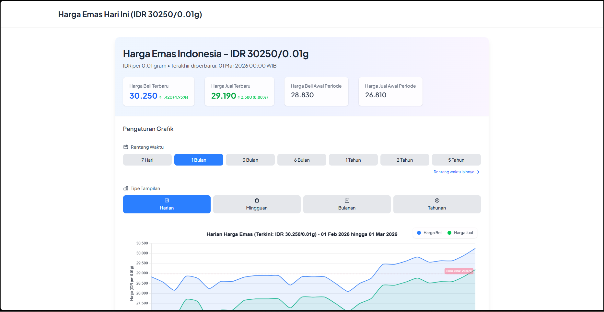

# HargaEmas – Gold Price Tracker (IDR)



HargaEmas is a small Django-based web application for tracking gold prices in Indonesian Rupiah (IDR). It provides a live view of the latest price along with historical data visualization.

## Features

- Live gold price view (IDR per 0.01 gram) with latest buy/sell prices
- Historical price data API endpoint with configurable periods (days, months, years)
- Interactive chart page built with Chart.js and related plugins
- Cached API responses for better performance
- SEO-focused page metadata (Open Graph, Twitter cards, JSON-LD)
- RSS feed for the latest gold price
- robots.txt and sitemap.xml integration

## Tech Stack

- Python 3.12
- Django 5
- SQLite (default local database)
- Requests (external API integration)
- python-decouple (environment configuration)
- django-cors-headers
- Whitenoise for static files
- Deployed via Vercel (using Django WSGI entrypoint)

## Project Structure

- `HargaEmas/` – Django project configuration (settings, URLs, WSGI/ASGI)
- `apps/gold/` – Main application providing the gold price tracker
  - `views.py` – Page rendering and JSON API for gold price data
  - `urls.py` – Routes for main page, API, RSS feed, and robots.txt
  - `feeds.py` – Latest gold price RSS feed
  - `templates/gold/gold.html` – Main UI and chart page
  - `sitemaps.py` – Sitemap configuration for static views
- `templates/base.html` – Base HTML layout and SEO meta tags
- `staticfiles/` – Collected static assets (CSS, JS, etc.)
- `vercel.json` – Vercel deployment configuration

## Getting Started (Local Development)

### 1. Prerequisites

- Python 3.12 (or compatible 3.x version)
- pip
- Optional but recommended: virtual environment (venv)

### 2. Clone and set up environment

```bash
cd path/to/your/workspace
python -m venv .venv
source .venv/Scripts/activate  # on Windows PowerShell: .venv\Scripts\Activate.ps1
pip install -r requirements.txt
```

### 3. Environment variables

Create a `.env` file in the project root with at least:

```env
SECRET_KEY=your-django-secret-key
DEBUG=True
DATA_URL=https://your-external-gold-price-api-endpoint
```

`DATA_URL` should be the base URL used to query the external gold price API.

### 4. Database migrations

```bash
python manage.py migrate
```

### 5. Run the development server

```bash
python manage.py runserver
```

Then open `http://127.0.0.1:8000/` in your browser.

## Key Endpoints

- `/` – Main gold price page with live price and chart
- `/api/data/?period=1m` – JSON endpoint for historical price data; `period` supports values like `7d`, `30d`, `1m`, `3m`, `1y`, `5y`, `20y`
- `/feed/` – RSS feed for the latest gold price
- `/sitemap.xml` – Sitemap for SEO (project-level)
- `/robots.txt` – Robots instructions (served from the gold app)

## Deployment (Vercel)

The project is configured for deployment on Vercel via `vercel.json`:

- Uses `HargaEmas/wsgi.py` as the WSGI entrypoint via `@vercel/python`
- Routes `static/(.*)` to `staticfiles/`
- Routes all other paths to the Django app

Typical steps:

- Ensure `DEBUG=False` and production hostnames are configured in `HargaEmas/settings.py`
- Set environment variables (`SECRET_KEY`, `DEBUG`, `DATA_URL`, and any others) in the Vercel dashboard
- Run `python manage.py collectstatic` during your build step so that static files are available under `staticfiles/`

## Notes

- The application is primarily targeted at Indonesian users (language `id-ID` and IDR currency).
- Be mindful of API rate limits and terms of use for the external gold price provider.
